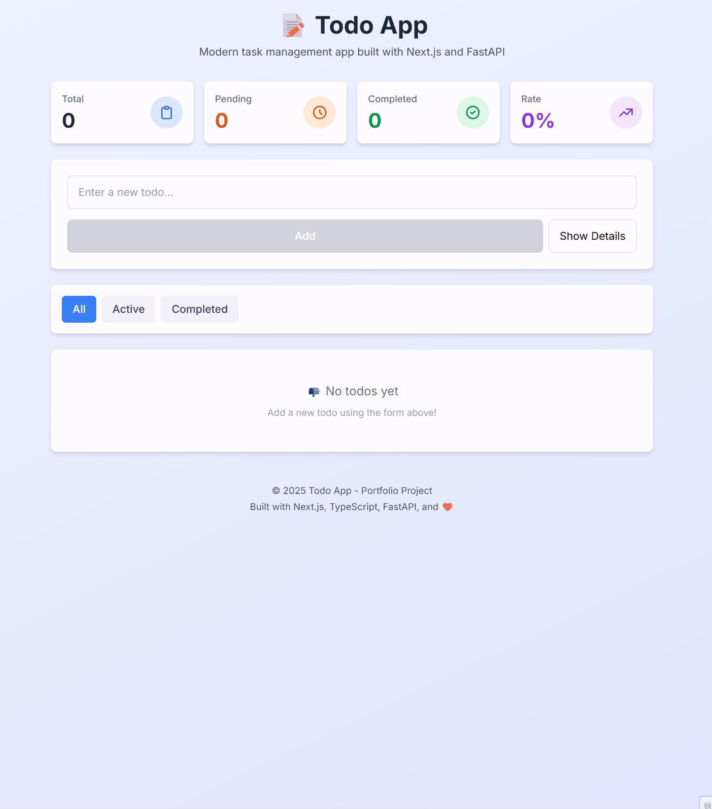
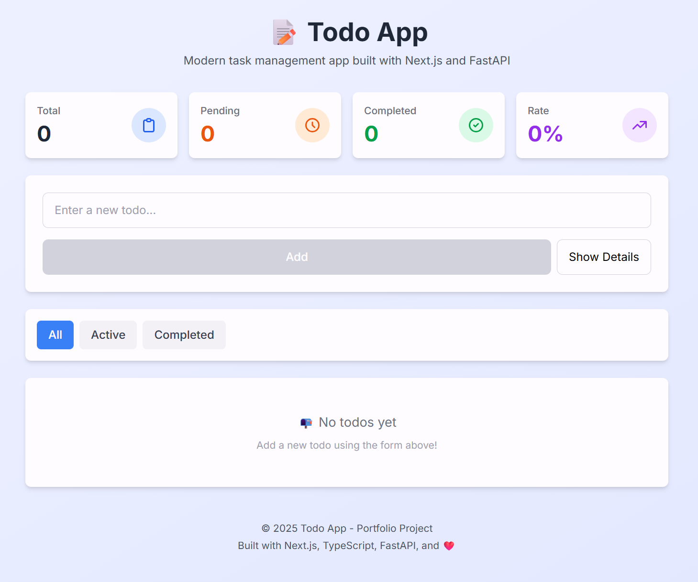
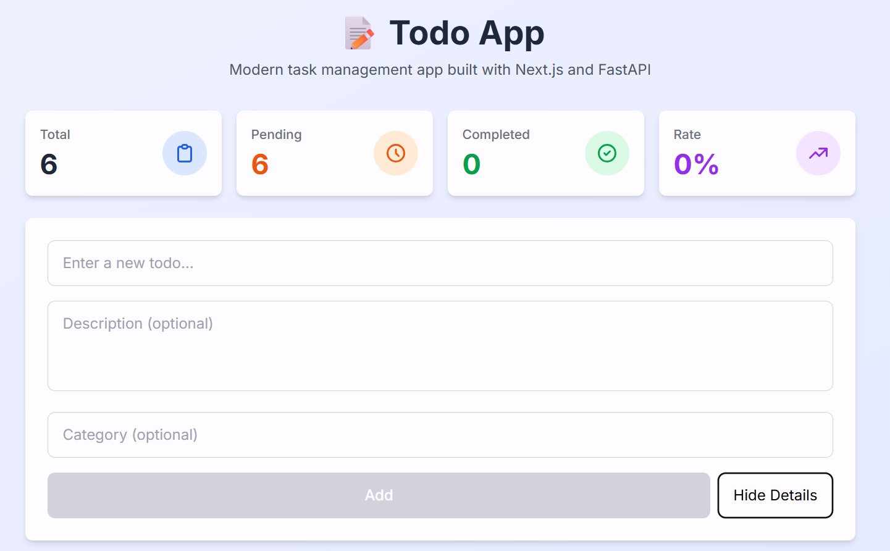
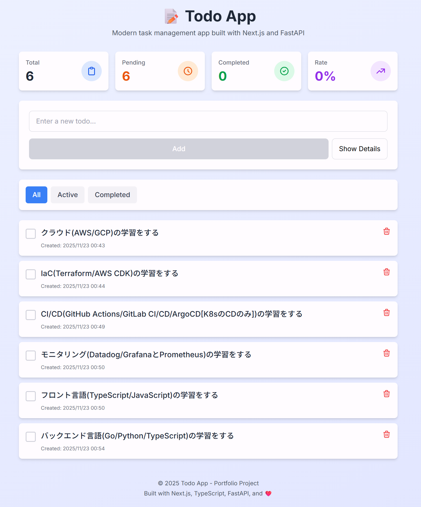
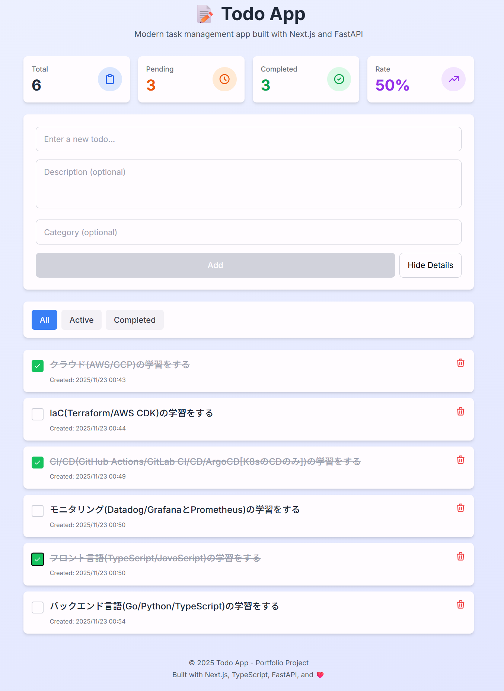
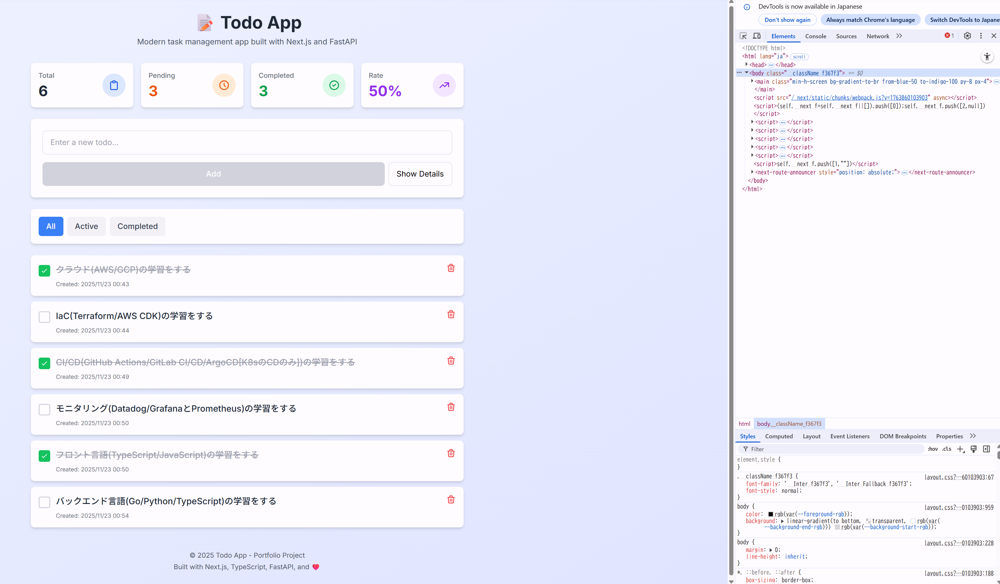

# 📝 Todo App - ポートフォリオプロジェクト

Next.js と FastAPI で構築したモダンなタスク管理アプリケーションです。

## 🌐 ライブデモ

**🚀 [ライブデモ](https://your-demo-url.vercel.app)** *（準備中）*

> **注意:** バックエンドは Render.com の無料プランを使用しているため、初回リクエスト時にサーバーの起動に約15秒かかる場合があります。

## 🎥 デモ動画



## 📸 スクリーンショット

### メインダッシュボード


### Todo作成


### Todoリスト


### フィルター表示


### モバイル対応


## 📚 ドキュメント

- 📋 [要件定義書](REQUIREMENTS.md) - プロジェクトの目的、ターゲットユーザー、機能
- 🚀 [セットアップガイド](SETUP.md) - アプリケーションの起動方法
- 💻 [開発ガイド](DEVELOPMENT.md) - Gitワークフローと開発のベストプラクティス

## 🚀 技術スタック

### フロントエンド
- **Next.js 14** - SSR/SSG対応のReactフレームワーク
- **TypeScript** - 型安全な開発
- **Tailwind CSS** - ユーティリティファーストなCSSフレームワーク
- **Axios** - HTTPクライアント

### バックエンド
- **Python 3.11** - プログラミング言語
- **FastAPI** - 高性能Webフレームワーク
- **Pydantic** - データバリデーション
- **Uvicorn** - ASGIサーバー

### インフラ
- **Docker** - コンテナ化
- **Docker Compose** - マルチコンテナオーケストレーション
- **PostgreSQL 16** - リレーショナルデータベース

## ✨ 機能

- ✅ TodoのCRUD操作（作成、読み取り、更新、削除）
- ✅ カテゴリ管理
- ✅ 完了状態の切り替え
- ✅ ステータスによるフィルタリング（すべて / 未完了 / 完了済み）
- ✅ 統計ダッシュボード
- ✅ レスポンシブデザイン
- ✅ リアルタイム更新

## 🎯 プロジェクトの目的

このプロジェクトでは以下のスキルを実証します:
- フルスタック開発スキル（フロントエンド + バックエンド + インフラ）
- モダンな技術スタック（Next.js、FastAPI、Docker、PostgreSQL）
- RESTful APIの設計と実装
- レスポンシブなUI/UXデザイン
- Dockerによるコンテナ化とデプロイ
- Gitワークフローとドキュメンテーション

詳細なプロジェクト要件とアーキテクチャの決定については、[要件定義書](REQUIREMENTS.md)を参照してください。

## 🏗️ プロジェクト構成

```
app1/
├── backend/              # FastAPI バックエンド
│   ├── main.py          # メインアプリケーション
│   ├── requirements.txt # Python 依存関係
│   ├── Dockerfile       # バックエンド用 Docker 設定
│   └── .gitignore       # Git 除外設定
├── frontend/            # Next.js フロントエンド
│   ├── src/
│   │   ├── app/        # Next.js App Router
│   │   ├── components/ # React コンポーネント
│   │   ├── lib/        # ユーティリティ
│   │   └── types/      # TypeScript 型定義
│   ├── package.json    # Node.js 依存関係
│   ├── Dockerfile      # フロントエンド用 Docker 設定
│   └── tsconfig.json   # TypeScript 設定
├── docs/                # ドキュメント・画像
│   ├── images/         # スクリーンショット
│   └── demo.gif        # デモ動画
├── docker-compose.yml   # Docker Compose 設定
├── README.md           # このファイル
├── REQUIREMENTS.md     # 要件定義書
├── SETUP.md            # セットアップガイド
└── DEVELOPMENT.md      # 開発ガイド
```

## 🛠️ セットアップ方法

### 前提条件

- Docker Desktop がインストールされていること
- Git がインストールされていること

### 1. リポジトリのクローン

```bash
git clone <repository-url>
cd app1
```

### 2. Docker Compose で起動

```bash
# すべてのサービスをビルド・起動
docker-compose up --build

# バックグラウンドで起動する場合
docker-compose up -d --build
```

### 3. アプリケーションへアクセス

- **フロントエンド**: http://localhost:3000
- **バックエンド API**: http://localhost:8000
- **API ドキュメント**: http://localhost:8000/docs

### 4. 停止

```bash
# サービスを停止
docker-compose down

# データベースのボリュームも削除する場合
docker-compose down -v
```

## 💻 ローカル開発（Docker なし）

### バックエンド

```bash
cd backend

# 仮想環境を作成
python -m venv venv

# 仮想環境を有効化
# Windows
venv\Scripts\activate
# macOS/Linux
source venv/bin/activate

# 依存関係をインストール
pip install -r requirements.txt

# サーバーを起動
uvicorn main:app --reload
```

### フロントエンド

```bash
cd frontend

# 依存関係をインストール
npm install

# 開発サーバーを起動
npm run dev
```

## 📚 APIエンドポイント

### ヘルスチェック
- `GET /` - APIステータス
- `GET /health` - 詳細ヘルスチェック

### Todo管理
- `GET /api/todos` - Todo一覧取得
- `GET /api/todos/{id}` - 特定のTodo取得
- `POST /api/todos` - Todo作成
- `PUT /api/todos/{id}` - Todo更新
- `DELETE /api/todos/{id}` - Todo削除

### 統計
- `GET /api/todos/stats/summary` - 統計情報取得

詳細は http://localhost:8000/docs で確認できます。

## 🎨 主な機能のデモ

1. **Todo作成**: タイトル、説明、カテゴリを入力して新しいTodoを追加
2. **フィルタリング**: すべて/未完了/完了済みでTodoを絞り込み
3. **完了切替**: チェックボックスをクリックして完了状態を変更
4. **削除**: ゴミ箱アイコンをクリックしてTodoを削除
5. **統計表示**: リアルタイムでTodoの統計情報を表示

## 🚀 今後の拡張機能

- [ ] ユーザー認証（JWT）
- [ ] データベース永続化（PostgreSQL本番連携）
- [ ] 期限管理・通知機能
- [ ] ドラッグ&ドロップによる並び替え
- [ ] ファイル添付機能（S3連携）
- [ ] 検索機能の強化
- [ ] タグ機能
- [ ] AWSへのデプロイ（ECS/RDS/S3/CloudFront）
- [ ] CI/CDパイプライン（GitHub Actions）
- [ ] テストコード（Pytest/Jest）

## 📝 環境変数

### バックエンド（`.env`）

```env
DATABASE_URL=postgresql://postgres:postgres@db:5432/todoapp
SECRET_KEY=your-secret-key-here
ENVIRONMENT=development
```

### フロントエンド（`.env.local`）

```env
NEXT_PUBLIC_API_URL=http://localhost:8000
```

## 🤝 コントリビューション

プルリクエストを歓迎します！大きな変更の場合は、まずイシューを開いて変更内容を議論してください。

## 📄 ライセンス

MIT License

## 👤 作成者

Portfolio Project - 2025

---

**Next.js、TypeScript、FastAPI、Docker、PostgreSQL で構築 ❤️**
